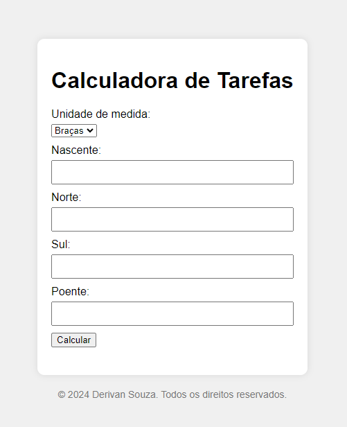
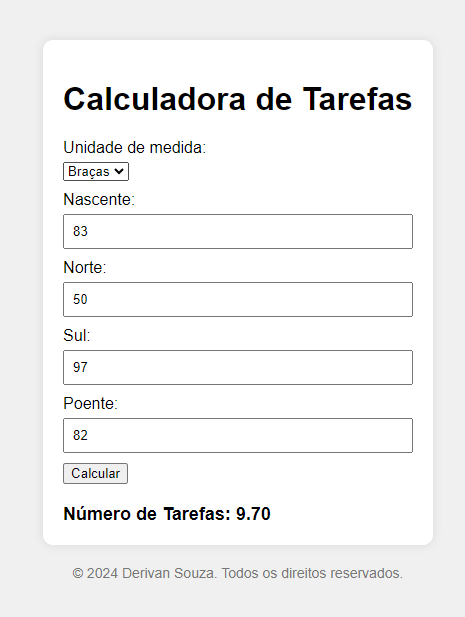

# Calculadora de Tarefas

Calcule uma área em metros ou braças para tarefas.

[Visite o site](https://DerivanSa.github.io/Calculadora-de-Tarefas/)

## Como Usar

1. Selecione a unidade de medida: Metros ou Braças.
2. Insira o comprimento de cada lado nos campos indicados:
   - Nascente (Leste)
   - Norte
   - Sul
   - Poente (Oeste)

Para números decimais, use vírgula ou ponto, por exemplo: `89.70` ou `54,24`.

3. Clique no botão `Calcular`. O número de tarefas será exibido.

## Autor

Derivan Souza
