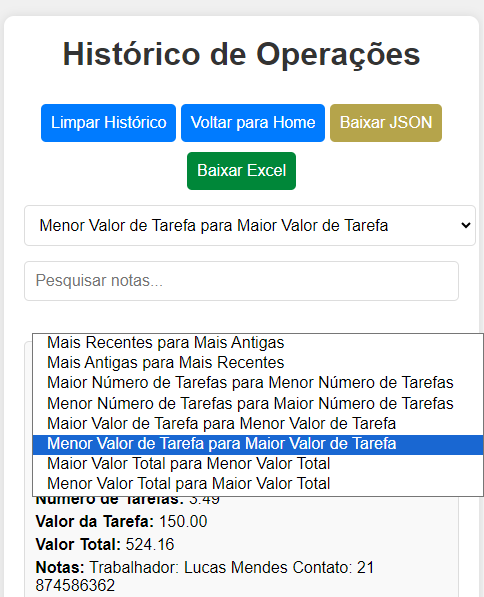

# Calculadora de Tarefas

Calcule áreas em metros ou braças para suas tarefas.

[Visite o site](https://DerivanSa.github.io/Calculadora-de-Tarefas/)

**Como Usar**

1. **Selecione a unidade de medida**: Metros ou Braças.
2. **Insira as dimensões** nos campos apropriados:
   - Nascente (Leste)
   - Norte
   - Sul
   - Poente (Oeste)

   Para números decimais, você pode usar ponto ou vírgula, por exemplo: `89.70` ou `54,24`.

3. **Opcional**: Insira o valor de cada tarefa para calcular o valor total a pagar ou receber.

4. **Clique em "Calcular"**. O número de tarefas será exibido. Se você inserir o valor da tabela, o valor total também será calculado.


**Página de Histórico**

Na página de histórico, você pode visualizar todas as operações realizadas no site. Disponibilizamos os seguintes recursos:

- **Limpar Histórico**: Remova todos os registros.
- **Voltar para Home**: Retorne à página principal.


- **Baixar Histórico**: Exporte o histórico como um arquivo JSON ou em formato Excel.

Json
```
[
  {
    "id": 1,
    "date": "15/08/2024, 08:39:21",
    "measure": "metros",
    "nascente": "700.00",
    "norte": "200.00",
    "sul": "463.00",
    "poente": "400.00",
    "multiplier": "",
    "numberOfTarefas": "60.27",
    "totalValue": "",
    "note": "João Pedro"
  },
  {
    "id": 2,
    "date": "15/08/2024, 08:39:35",
    "measure": "metros",
    "nascente": "700.00",
    "norte": "200.00",
    "sul": "463.00",
    "poente": "400.00",
    "multiplier": "250.00",
    "numberOfTarefas": "60.27",
    "totalValue": "15068.18",
    "note": ""
  }
```
Excel


- **Organizar Itens**: Modifique a ordem dos itens exibidos, com opções para visualizar do mais recente ao mais antigo ou outras formas de organização.



- **Pesquisar Notas**: Busque termos inseridos nas notas de qualquer operação.


Cada operação inclui todos os dados inseridos no momento, com duas opções adicionais:

- **Adicionar Nota**: Insira informações adicionais, como o nome do trabalhador, meio de contato ou qualquer outro detalhe relevante.
- **Excluir Operação**: Remova uma operação específica do histórico.


## Autor

[Derivan Souza](https://github.com/DerivanSa)
